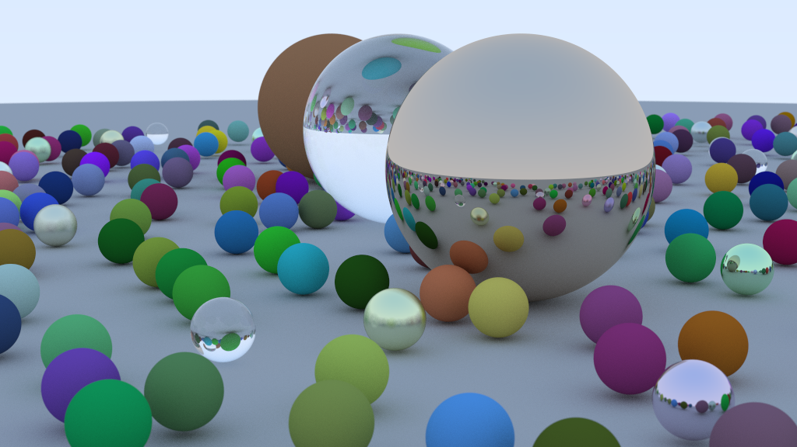

# Ray Tracing in Rust

[](https://www.rust-lang.org/)


A Rust implementation of Peter Shirley's *Ray Tracing in One Weekend* featuring advanced rendering techniques and parallel processing.



## Features

- **Physically-based Rendering**
  - Lambertian diffuse materials
  - Metallic reflection with fuzz
  - Dielectric refraction (glass)
  - Defocus blur (depth of field)
- **Optimizations**
  - Parallel rendering with Rayon
  - Gamma correction
  - Anti-aliasing with multi-sampling
- **Scene Configuration**
  - Configurable camera (FOV, focus, aspect ratio)
  - Random scene generation
  - Hittable object system

## Code Structure

```
src/
├── camera.rs       # Camera model and rendering pipeline
├── hittable.rs     # Hit detection and surface interaction
├── material.rs     # Material implementations (Lambertian, Metal, Dielectric)
├── sphere.rs       # Sphere geometry implementation
├── vec3.rs         # 3D vector/color/point operations
├── ray.rs          # Ray casting implementation
└── main.rs         # Scene setup and entry point
```

## Getting Started

### Prerequisites

- Rust 1.70+
- Cargo
- Image viewer that supports PPM format

### Installation

```bash
git clone https://github.com/orielsanchez/raytracing.git
cd raytracing
cargo build --release
```

### Running

Render a sample scene with 500 samples per pixel and depth of field:

```bash
cargo run --release > output.ppm
```

Key configuration options (edit `main.rs` to modify):
- `samples_per_pixel`: Controls anti-aliasing quality
- `max_depth`: Maximum ray bounce depth
- `defocus_angle`: Depth of field effect intensity
- `vfov`: Vertical field of view

## Technical Highlights

- **Parallel Rendering**  
  Utilizes Rayon's parallel iterators for pixel processing:
  ```rust
  (0..self.image_width).into_par_iter().map(|i| {
      // Pixel processing logic
  })
  ```

- **Material System**  
  Polymorphic material handling with trait objects:
  ```rust
  pub trait Material: Send + Sync {
      fn scatter(&self, r_in: &Ray, rec: &HitRecord, 
                attenuation: &mut Color, scattered: &mut Ray) -> bool;
  }
  ```

- **Physically Accurate Camera**  
  Implements depth of field with defocus disk sampling:
  ```rust
  fn defocus_disk_sample(&self) -> Point3 {
      let p = Vec3::random_in_unit_disk();
      self.center + (p.x() * self.defocus_disk_u) + (p.y() * self.defocus_disk_v)
  }
  ```

## Example Output

The default scene includes:
- Ground plane with diffuse material
- 3 large spheres (glass, diffuse, metal)
- ~400 randomly placed small spheres with varying materials

Expected render time (1024x576, 500 samples):
- Release build: 2-5 minutes (depending on hardware)
- Debug build: 10-15 minutes

## Dependencies

- `rayon` for parallel processing
- `rand` for random number generation
- No external image dependencies (outputs PPM directly)

## License

MIT License - see [LICENSE](LICENSE) for details

## Acknowledgments

Based on [*Ray Tracing in One Weekend*](https://raytracing.github.io/books/RayTracingInOneWeekend.html)  
Rust adaptations by Oriel Sanchez
